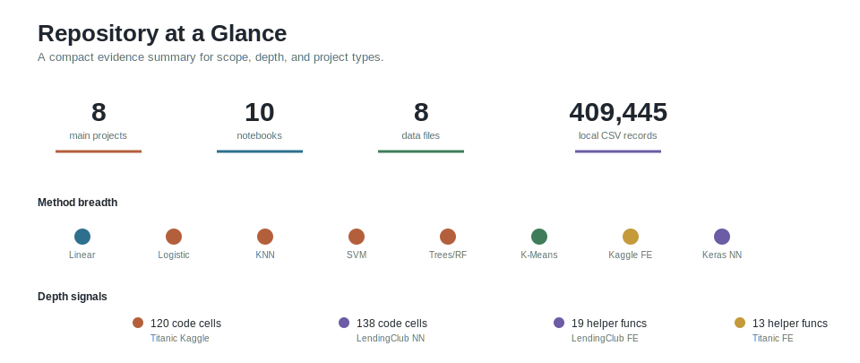
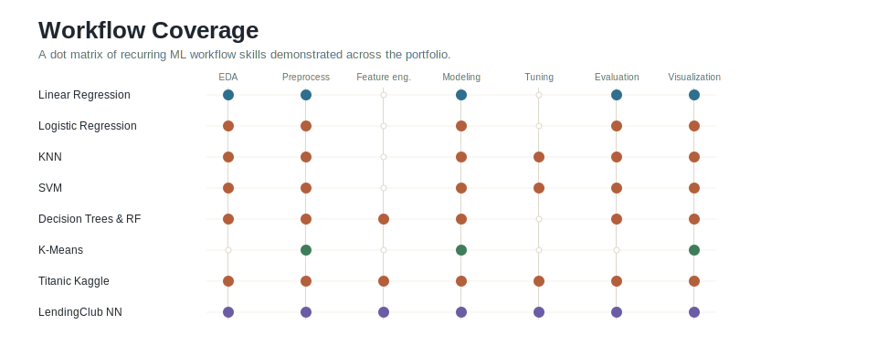
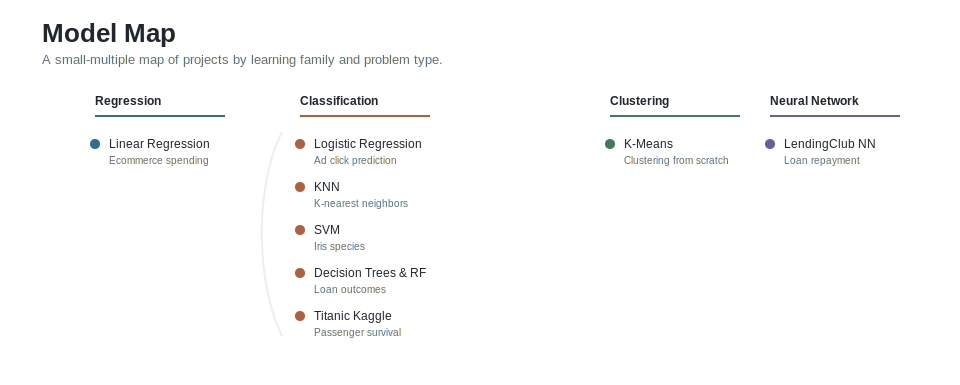
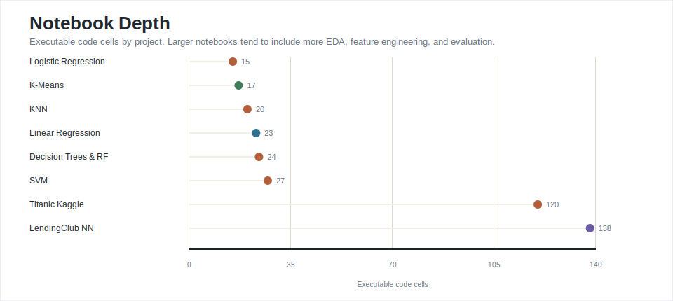
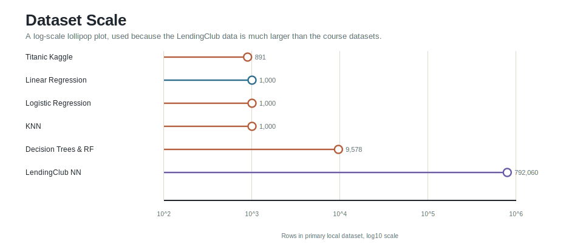
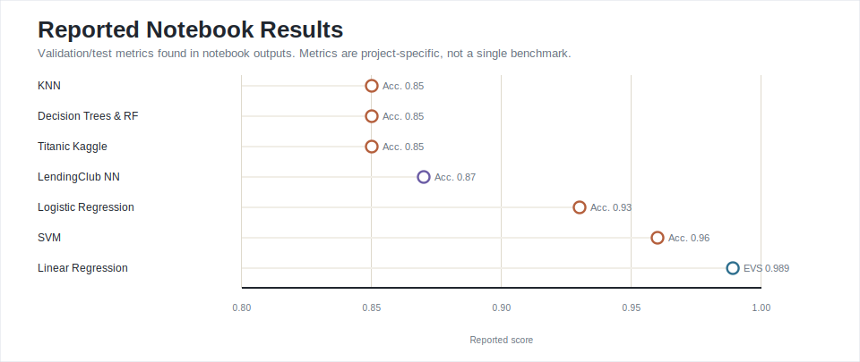

# ML Projects

A machine learning portfolio that demonstrates practical modeling skill across regression, classification, clustering, ensemble learning, Kaggle-style feature engineering, and neural networks.

This repository is not a single experiment. It is a collection of applied notebooks that show the full ML workflow: data inspection, exploratory analysis, preprocessing, feature engineering, model training, hyperparameter tuning, evaluation, and visual communication.



## What This Repository Demonstrates

- Ability to work across core supervised learning families: linear models, logistic regression, KNN, SVM, decision trees, random forests, and neural networks.
- Practical data preparation skills, including scaling, categorical encoding, missing-value handling, feature grouping, and domain-specific feature engineering.
- Model evaluation discipline through train/test splits, classification reports, confusion matrices, regression errors, explained variance, and validation metrics.
- Experience with both small educational datasets and larger real-world tabular data, including a LendingClub dataset with 396,030 local CSV records.
- Communication through notebooks, project-specific READMEs, interactive HTML artifacts, dashboards, and clean summary figures.



## Project Index

| Project | Focus | Main evidence |
| --- | --- | --- |
| [Linear Regression](Linear_Regression/02-Linear%20Regression%20Project.ipynb) | Regression | Ecommerce spending model with MAE, MSE, RMSE, and explained variance. |
| [Logistic Regression](Logistic_Regression/02-Logistic%20Regression%20Project.ipynb) | Classification | Advertising click prediction with a 0.93 reported accuracy. |
| [KNN](KNN/02-K%20Nearest%20Neighbors%20Project.ipynb) | Classification | Standardization, K selection, and improved accuracy after tuning. |
| [SVM](SVM/02-Support%20Vector%20Machines%20Project.ipynb) | Classification | Iris classification with GridSearchCV practice and strong class-level metrics. |
| [Decision Trees & Random Forest](dtree_and_rfc/02-Decision%20Trees%20and%20Random%20Forest%20Project.ipynb) | Tree models | LendingClub loan classification with categorical handling and model comparison. |
| [K-Means](Kmeans/kmeans_nour.ipynb) | Clustering | From-scratch K-means implementation with centroid updates and visualization. |
| [Titanic Kaggle](Titanic-kaggle/titanic_v3.0.ipynb) | Kaggle workflow | Extensive feature engineering, ensemble-style modeling, and competition-oriented evaluation. |
| [LendingClub Neural Network](artificial_neural_network/LendingClub_project.ipynb) | Deep learning | Large tabular loan-status model with engineered features and TensorFlow/Keras training. |

## Portfolio Coverage







## Reported Results

The chart below summarizes metrics visible in notebook outputs. These are project-specific results, not a single standardized benchmark across identical datasets.



| Project | Reported result from notebook/output |
| --- | --- |
| Linear Regression | Explained variance: 0.989; RMSE: 8.934 |
| Logistic Regression | Accuracy: 0.93 |
| KNN | Accuracy improved from 0.74 to 0.85 after selecting K=28 |
| SVM | Accuracy: 0.96 on Iris classification |
| Decision Trees & Random Forest | Random forest accuracy: 0.85 |
| Titanic Kaggle | Validation accuracy around 0.85; project note reports Kaggle score 0.80622 |
| LendingClub Neural Network | Accuracy: 0.87 on a large validation/test split |

## Project Details

### Linear Regression

This notebook models yearly ecommerce customer spending from behavioral features such as session length, app usage, website usage, and membership length. It demonstrates a clean regression workflow: inspect the dataset, visualize feature relationships, split training and test data, fit a linear model, inspect coefficients, evaluate residuals, and report regression error metrics.

Skills shown: regression modeling, coefficient interpretation, residual analysis, regression metrics, and business-facing recommendation framing.

### Logistic Regression

This project predicts whether a user clicked on an advertisement using demographic and usage features such as time on site, age, area income, and internet usage. The notebook includes exploratory analysis, train/test splitting, logistic model fitting, and classification-report evaluation.

Skills shown: binary classification, classification reports, confusion-matrix interpretation, and practical use of scikit-learn for interpretable baseline models.

### K Nearest Neighbors

The KNN notebook focuses on distance-based classification. It standardizes the feature space, trains an initial KNN model, evaluates it, then searches across K values to improve performance. The reported accuracy improves from 0.74 to 0.85 after tuning.

Skills shown: feature scaling, distance-based learning, hyperparameter search, error-rate analysis, and model iteration.

### Support Vector Machines

This project uses the Iris dataset to train and evaluate SVM classifiers. It includes exploratory visualization, train/test splitting, model evaluation, and GridSearchCV practice for tuning SVM parameters.

Skills shown: margin-based classification, multiclass evaluation, grid search, and visual EDA for separability.

### Decision Trees and Random Forest

This notebook explores LendingClub loan data with tree-based models. It prepares categorical variables, trains a decision tree and a random forest, and compares classification reports and confusion matrices. The project also exposes a realistic modeling issue: high overall accuracy can hide weak minority-class recall.

Skills shown: tree models, ensemble learning, categorical encoding, model comparison, and critical evaluation of imbalanced classification results.

### K-Means From Scratch

Unlike the scikit-learn projects, this notebook implements the K-means algorithm directly. It defines centroid initialization, point assignment, centroid updates, and visualization of clustering behavior on two-dimensional data.

Skills shown: algorithm implementation, vector reasoning, clustering fundamentals, and visualization of iterative unsupervised learning.

### Titanic Kaggle

The Titanic notebook is one of the deepest projects in the repository. It includes extensive EDA, feature engineering functions for titles, sex, age groups, embarked values, family structure, child indicators, fare grouping, and feature dropping. The project also includes correlation images and interactive HTML analysis artifacts.

Skills shown: Kaggle-style workflow, domain-driven feature engineering, ensemble-oriented thinking, missing-data handling, validation, and competition submission framing.

Related artifacts:

- [Titanic project README](Titanic-kaggle/README.md)
- [Correlation before engineering](Titanic-kaggle/data_corr_before_eng.png)
- [Correlation after engineering](Titanic-kaggle/data_corr_after_eng.png)

### LendingClub Neural Network

The LendingClub neural network project is the largest and most advanced notebook in the portfolio. It works with a large loan-status dataset and performs extensive feature engineering across home ownership, loan purpose, employment length, employment title, mortgage accounts, bankruptcies, loan term, grade, sub-grade, verification status, issue date, and application type.

The project then trains a TensorFlow/Keras neural network to predict whether a borrower is likely to fully repay a loan. It also includes a saved Keras model and a small dashboard script for loan-status exploration.

Skills shown: large tabular data handling, deep learning, high-volume feature engineering, model persistence, dashboard-oriented communication, and evaluation at scale.

Related artifacts:

- [LendingClub project README](artificial_neural_network/README.md)
- [Loan status dashboard script](artificial_neural_network/loan_status_dashboard.py)
- [Saved neural network model](artificial_neural_network/LendingClub_NN.h5)

## Tools Used

`Python` | `NumPy` | `Pandas` | `Matplotlib` | `Seaborn` | `Plotly` | `scikit-learn` | `TensorFlow/Keras` | `Yellowbrick`

## Repository Structure

```text
ML_Projects/
|-- KNN/
|-- Kmeans/
|-- Linear_Regression/
|-- Logistic_Regression/
|-- SVM/
|-- Titanic-kaggle/
|-- artificial_neural_network/
|-- dtree_and_rfc/
|-- assets/readme/
`-- README.md
```

## Notes on the Figures

The README figures were generated from the files in this repository. Their style follows examples and principles from [Fundamentals of Data Visualization](https://clauswilke.com/dataviz/) and the [Scientific Visualization book](https://github.com/rougier/scientific-visualization-book): Cleveland dot plots for amounts, proportional bars for composition, log-scale lollipop plots for scale, direct labeling, restrained color, and minimal decoration.
