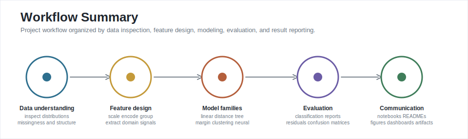

# ML Projects

This repository contains applied machine learning notebooks covering regression, classification, clustering, ensemble learning, Kaggle-style feature engineering, and neural-network modeling.

The notebooks document recurring stages of a machine learning workflow: data inspection, exploratory analysis, preprocessing, feature engineering, model training, hyperparameter tuning, evaluation, and result reporting.



## Technical Coverage

- Coverage of core supervised learning families: linear models, logistic regression, KNN, SVM, decision trees, random forests, and neural networks.
- Data preparation across scaling, categorical encoding, missing-value handling, feature grouping, and domain-specific feature engineering.
- Model evaluation through train/test splits, classification reports, confusion matrices, regression errors, explained variance, and validation metrics.
- Datasets include small educational examples and larger tabular data, including a LendingClub dataset with 396,030 local CSV records.
- Supporting artifacts include notebooks, project-specific READMEs, interactive HTML files, dashboard code, and figures.


## Project Index

| Project | Focus | Main output |
| --- | --- | --- |
| [Linear Regression](Linear_Regression/02-Linear%20Regression%20Project.ipynb) | Regression | Ecommerce spending model with regression error analysis. |
| [Logistic Regression](Logistic_Regression/02-Logistic%20Regression%20Project.ipynb) | Classification | Advertising click prediction with train/test evaluation. |
| [KNN](KNN/02-K%20Nearest%20Neighbors%20Project.ipynb) | Classification | Standardization, K selection, and error-rate analysis. |
| [SVM](SVM/02-Support%20Vector%20Machines%20Project.ipynb) | Classification | Iris classification with GridSearchCV practice and class-level metrics. |
| [Decision Trees & Random Forest](dtree_and_rfc/02-Decision%20Trees%20and%20Random%20Forest%20Project.ipynb) | Tree models | LendingClub loan classification with categorical handling and model comparison. |
| [K-Means](Kmeans/kmeans_nour.ipynb) | Clustering | From-scratch K-means implementation with centroid updates and visualization. |
| [Titanic Kaggle](Titanic-kaggle/titanic_v3.0.ipynb) | Kaggle workflow | Feature engineering, ensemble-style modeling, and competition-oriented evaluation. |
| [LendingClub Neural Network](artificial_neural_network/LendingClub_project.ipynb) | Deep learning | Large tabular loan-status model with engineered features and TensorFlow/Keras training. |

## Model and Data Coverage


## Project Details

### Linear Regression

This notebook models yearly ecommerce customer spending from behavioral features such as session length, app usage, website usage, and membership length. The workflow includes dataset inspection, feature relationship plots, train/test splitting, linear model fitting, coefficient inspection, residual analysis, and regression error metrics.

Methods used: regression modeling, coefficient interpretation, residual analysis, regression metrics, and decision-oriented interpretation.

### Logistic Regression

This project predicts whether a user clicked on an advertisement using demographic and usage features such as time on site, age, area income, and internet usage. The notebook includes exploratory analysis, train/test splitting, logistic model fitting, and classification-report evaluation.

Methods used: binary classification, classification reports, confusion-matrix interpretation, and scikit-learn baseline modeling.

### K Nearest Neighbors

The KNN notebook focuses on distance-based classification. It standardizes the feature space, trains an initial KNN model, evaluates it, then searches across K values to compare error behavior under different neighborhood sizes.

Methods used: feature scaling, distance-based learning, hyperparameter search, error-rate analysis, and model iteration.

### Support Vector Machines

This project uses the Iris dataset to train and evaluate SVM classifiers. It includes exploratory visualization, train/test splitting, model evaluation, and GridSearchCV practice for tuning SVM parameters.

Methods used: margin-based classification, multiclass evaluation, grid search, and visual EDA for separability.

### Decision Trees and Random Forest

This notebook explores LendingClub loan data with tree-based models. It prepares categorical variables, trains a decision tree and a random forest, and compares classification reports and confusion matrices. The project also illustrates a known modeling issue: aggregate metrics can hide weak minority-class recall.

Methods used: tree models, ensemble learning, categorical encoding, model comparison, and critical evaluation of imbalanced classification results.

### K-Means From Scratch

Unlike the scikit-learn projects, this notebook implements the K-means algorithm directly. It defines centroid initialization, point assignment, centroid updates, and visualization of clustering behavior on two-dimensional data.

Methods used: algorithm implementation, vector reasoning, clustering fundamentals, and visualization of iterative unsupervised learning.

### Titanic Kaggle

The Titanic notebook is a feature-engineering-heavy Kaggle workflow. It includes EDA, feature engineering functions for titles, sex, age groups, embarked values, family structure, child indicators, fare grouping, and feature dropping. The project also includes correlation images and interactive HTML analysis artifacts.

Methods used: Kaggle-style workflow, domain-driven feature engineering, ensemble-oriented thinking, missing-data handling, validation, and competition submission framing.

Related artifacts:

- [Titanic project README](Titanic-kaggle/README.md)
- [Correlation before engineering](Titanic-kaggle/data_corr_before_eng.png)
- [Correlation after engineering](Titanic-kaggle/data_corr_after_eng.png)

### LendingClub Neural Network

The LendingClub neural network project works with a large loan-status dataset and performs feature engineering across home ownership, loan purpose, employment length, employment title, mortgage accounts, bankruptcies, loan term, grade, sub-grade, verification status, issue date, and application type.

The project then trains a TensorFlow/Keras neural network to predict whether a borrower is likely to fully repay a loan. It also includes a saved Keras model and a small dashboard script for loan-status exploration.

Methods used: large tabular data handling, deep learning, feature engineering, model persistence, dashboard code, and held-out evaluation.

Related artifacts:

- [LendingClub project README](artificial_neural_network/README.md)
- [Loan status dashboard script](artificial_neural_network/loan_status_dashboard.py)
- [Saved neural network model](artificial_neural_network/LendingClub_NN.h5)

## Tools Used

`Python` | `NumPy` | `Pandas` | `Matplotlib` | `Seaborn` | `Plotly` | `scikit-learn` | `TensorFlow/Keras` | `Yellowbrick`

## Repository Structure

```text
ML_Projects/
|-- KNN/
|-- Kmeans/
|-- Linear_Regression/
|-- Logistic_Regression/
|-- SVM/
|-- Titanic-kaggle/
|-- artificial_neural_network/
|-- dtree_and_rfc/
|-- assets/readme/
`-- README.md
```

## Notes on the Figures

The README figures were generated from repository files and notebook outputs. Their style follows examples and principles from [Fundamentals of Data Visualization](https://clauswilke.com/dataviz/) and the [Scientific Visualization book](https://github.com/rougier/scientific-visualization-book): direct labeling, restrained color, proportional encodings, log scaling where appropriate, and minimal decoration.
