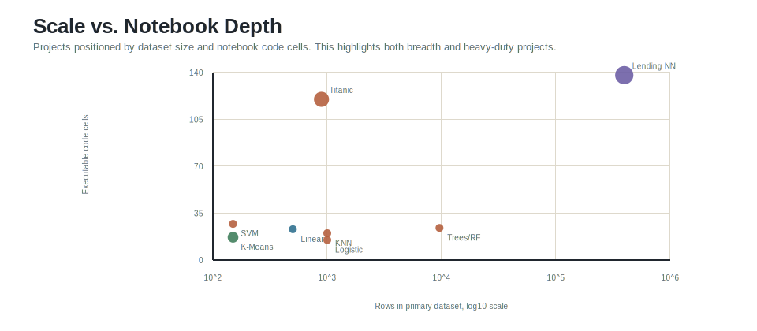
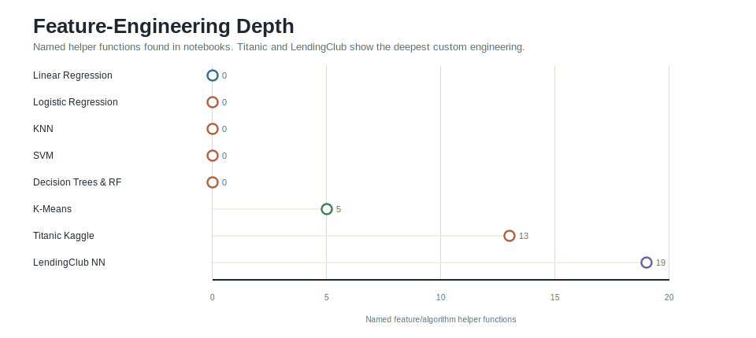

# ML Projects

This repository is a technical portfolio of applied machine learning notebooks. It covers regression, binary and multiclass classification, distance-based methods, support vector machines, decision trees, random forests, unsupervised clustering, Kaggle-style feature engineering, and neural-network modeling on large tabular data.

The emphasis is on end-to-end workflow: exploratory data analysis, preprocessing, feature engineering, model fitting, parameter selection, evaluation, and communication of results.


## Technical Scope

The repository demonstrates the following capabilities:

- Building interpretable baseline models with linear and logistic regression.
- Applying classical supervised learning methods including KNN, SVM, decision trees, and random forests.
- Implementing K-means clustering directly rather than relying only on a library abstraction.
- Engineering predictive features from messy tabular data in the Titanic and LendingClub projects.
- Training and evaluating a TensorFlow/Keras neural network on a large LendingClub loan-status dataset.
- Evaluating models with regression metrics, classification reports, confusion matrices, validation accuracy, and error analysis.
- Communicating analysis through notebooks, project READMEs, visual diagnostics, and supporting artifacts.


## Project Inventory

| Project | Learning task | Dataset / domain | Main technical contribution |
| --- | --- | --- | --- |
| [Linear Regression](Linear_Regression/02-Linear%20Regression%20Project.ipynb) | Regression | Ecommerce customer behavior | Regression modeling, residual analysis, coefficient interpretation, and error metrics. |
| [Logistic Regression](Logistic_Regression/02-Logistic%20Regression%20Project.ipynb) | Binary classification | Advertising click behavior | Logistic model training and classification-report evaluation. |
| [KNN](KNN/02-K%20Nearest%20Neighbors%20Project.ipynb) | Binary classification | Structured anonymized features | Feature scaling, K selection, and error-rate analysis. |
| [SVM](SVM/02-Support%20Vector%20Machines%20Project.ipynb) | Multiclass classification | Iris measurements | SVM classification, model evaluation, and GridSearchCV tuning. |
| [Decision Trees & Random Forest](dtree_and_rfc/02-Decision%20Trees%20and%20Random%20Forest%20Project.ipynb) | Binary classification | LendingClub loan data | Categorical encoding, tree-based modeling, ensemble comparison, and class-imbalance diagnosis. |
| [K-Means](Kmeans/kmeans_nour.ipynb) | Unsupervised learning | Synthetic two-dimensional points | From-scratch implementation of centroid initialization, assignment, update, and visualization. |
| [Titanic Kaggle](Titanic-kaggle/titanic_v3.0.ipynb) | Binary classification | Titanic survival prediction | Domain-specific feature engineering and competition-style model development. |
| [LendingClub Neural Network](artificial_neural_network/LendingClub_project.ipynb) | Binary classification | Loan repayment prediction | Large-scale tabular preprocessing, feature engineering, Keras modeling, and model persistence. |

## Portfolio Coverage





## Reported Results

The metrics below are taken from notebook outputs and project notes. They are not presented as a single benchmark because the projects use different datasets, tasks, splits, and evaluation objectives.


| Project | Reported result |
| --- | --- |
| Linear Regression | Explained variance: 0.989; RMSE: 8.934 |
| Logistic Regression | Accuracy: 0.93 |
| KNN | Accuracy improved from 0.74 to 0.85 after selecting K=28 |
| SVM | Accuracy: 0.96 on Iris classification |
| Decision Trees & Random Forest | Random forest accuracy: 0.85 |
| Titanic Kaggle | Validation accuracy around 0.85; project note reports Kaggle score 0.80622 |
| LendingClub Neural Network | Accuracy: 0.87 on a large validation/test split |

## Feature Engineering and Implementation Depth



The most substantial engineering work appears in the Titanic and LendingClub projects. Those notebooks define multiple helper functions for transforming categorical fields, grouping sparse categories, deriving domain-specific predictors, and preparing data for downstream models.

## Project Notes

### Linear Regression

The linear regression notebook models yearly ecommerce customer spending using behavioral variables such as session length, app usage, website usage, and membership length. The workflow includes EDA, train/test splitting, coefficient inspection, residual analysis, and regression metrics. The reported explained variance of 0.989 indicates that the fitted model captures the dominant structure in this educational dataset.

### Logistic Regression

The logistic regression notebook predicts advertising clicks from demographic and usage features. It demonstrates a clean binary-classification baseline with scikit-learn, including exploratory plots, model fitting, prediction, and classification-report interpretation. The notebook reports 0.93 accuracy on the evaluated split.

### K Nearest Neighbors

The KNN notebook highlights the importance of preprocessing for distance-based models. It standardizes the feature matrix, evaluates an initial classifier, then searches across K values. The reported accuracy improves from 0.74 to 0.85 after selecting K=28, showing an explicit model-iteration loop.

### Support Vector Machines

The SVM notebook uses the Iris dataset to demonstrate multiclass classification. It includes EDA for class separability, model training, evaluation with class-level precision/recall/F1 metrics, and GridSearchCV practice for parameter tuning.

### Decision Trees and Random Forest

The tree-model notebook uses LendingClub loan data to compare a decision tree and a random forest classifier. It includes categorical feature handling and confusion-matrix evaluation. The results also reveal an important modeling caveat: overall accuracy can look acceptable while minority-class recall remains weak, which is a realistic issue in imbalanced financial classification.

### K-Means From Scratch

The K-means notebook implements clustering logic directly. It defines helper functions for centroid initialization, assignment via minimum distance, and centroid updates. This project demonstrates algorithmic understanding beyond calling a package-level estimator.

### Titanic Kaggle

The Titanic project is a feature-engineering-heavy Kaggle workflow. It includes transformations for passenger titles, sex, age groups, embarkation values, family structure, child indicators, fare grouping, and feature selection. It also includes correlation images and interactive HTML artifacts used during analysis.

Related artifacts:

- [Titanic project README](Titanic-kaggle/README.md)
- [Correlation before engineering](Titanic-kaggle/data_corr_before_eng.png)
- [Correlation after engineering](Titanic-kaggle/data_corr_after_eng.png)

### LendingClub Neural Network

The LendingClub project is the largest and most advanced notebook in the repository. It works with 396,030 local CSV records and performs extensive preprocessing across home ownership, purpose, employment length, employment title, mortgage accounts, bankruptcies, term, grade, sub-grade, verification status, issue date, and application type. It then trains a TensorFlow/Keras neural network to predict loan repayment status and includes a saved model artifact.

Related artifacts:

- [LendingClub project README](artificial_neural_network/README.md)
- [Loan status dashboard script](artificial_neural_network/loan_status_dashboard.py)
- [Saved neural network model](artificial_neural_network/LendingClub_NN.h5)

## Tools and Libraries

`Python` | `NumPy` | `Pandas` | `Matplotlib` | `Seaborn` | `Plotly` | `scikit-learn` | `TensorFlow/Keras` | `Yellowbrick`

## Repository Structure

```text
ML_Projects/
|-- KNN/
|-- Kmeans/
|-- Linear_Regression/
|-- Logistic_Regression/
|-- SVM/
|-- Titanic-kaggle/
|-- artificial_neural_network/
|-- dtree_and_rfc/
|-- assets/readme/
`-- README.md
```

## Figure Design

The README figures were generated from repository metadata and notebook outputs. The visual style follows principles from [Fundamentals of Data Visualization](https://clauswilke.com/dataviz/) and the [Scientific Visualization book](https://github.com/rougier/scientific-visualization-book): direct labeling, restrained color, proportional encodings, log scaling where appropriate, and minimal non-data decoration.
